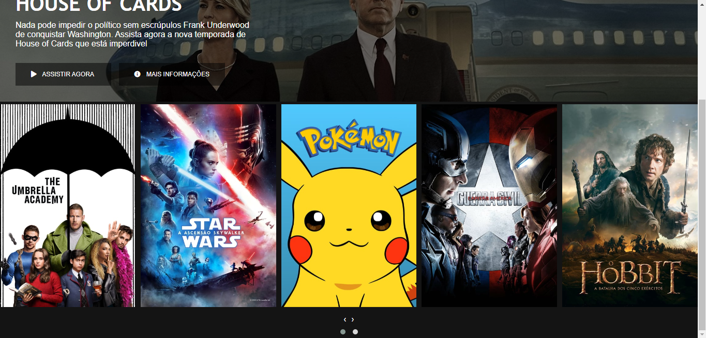

[](https://github.com/marioandre01)
[](#)
[](https://github.com/marioandre01/interface_do_netflix-dio/stargazers)
[](https://github.com/marioandre01/interface_do_netflix-dio/network/members)
[](https://github.com/marioandre01/interface_do_netflix-dio/graphs/contributors)
[](https://github.com/marioandre01/interface_do_netflix-dio/blob/master/LICENCE.md)


<h1 align="center">
    Interface do Netflix - DIO
</h1>

<p align="center"> 
  <a href="#-projeto">Projeto</a>&nbsp;&nbsp;&nbsp;|&nbsp;&nbsp;&nbsp;
  <a href="#-tecnologias">Tecnologias</a>&nbsp;&nbsp;&nbsp;|&nbsp;&nbsp;&nbsp;
  <a href="#-layout">Layout</a>&nbsp;&nbsp;&nbsp;|&nbsp;&nbsp;&nbsp;
  <a href="#-executando-a-aplicação">Executando a aplicação</a>&nbsp;&nbsp;&nbsp;|&nbsp;&nbsp;&nbsp;
  <a href="#gear-contribuição">Contribuição</a>&nbsp;&nbsp;&nbsp;|&nbsp;&nbsp;&nbsp;
  <a href="#memo-licença">Licença</a>
</p>

## 💻 Projeto

Esse projeto foi desenvolvido através do [bootcamp everis Fullstack Developer](https://web.digitalinnovation.one/track/everis-fullstack-developer) oferecido pela empresa Everis em parceria com a [Digital Innovation One - DIO](https://digitalinnovation.one/), um dos maiores ecossistema open education da América Latina. 

O projeto teve como objetivo recriar a Interface do Netflix, que consiste em uma página dividida em três partes, barra de navegação, seção com uma série selecionada e uma vitrine em formato de carrossel mostrando outras séries. 

Na barra de navegação é mostrado o logo da Netflix e quatro opções de navegação "Inicio", "Séries", "Filmes" e "Documentários". 

Na seção que mostra uma série já selecionada é mostrando o seu título, a descrição e dois botões. O primeiro descrito como "ASSISTIR AGORA" que neste projeto aponta para um link do youtube com o trailer da série. E o segundo descrito como "MAIS INFORMAÇÔES" que abre uma janela popup com mais informações da série. 

Na vitrine em formato de carrossel está inserido dez séries, onde é mostrado cinco por vez. Nessa vitrine aparece duas opções de botões. O primeiro desliza uma série por vez, e o segundo abaixo deste deliza cinco séries por vez. Caso a tela seja reduzida a visualização das séries é alterada de cinco para três, e se reduzir mais, de três para um.

No seu desenvolvimento se usou HTML o organizando de forma semântica. CSS onde se aprendeu truques de classe de "container" ou também conhecido como classe "wrapper". Utilizou-se também o flexbox para posicionar os elementos em tela. Se aprendeu e utilizou a usar ícones na página pegando eles pela internet usando o site [fontawesome](https://fontawesome.com/), onde foi utilizado o ícone de "play" no botão "ASSISTIR FILME" e o ícone de "info" no botão "MAIS INFORMAÇÕES". Para fazer a vitrine em formato de carrossel se viu e usou o plugin jquery [Owl Carousel 2](https://owlcarousel2.github.io/OwlCarousel2/) em seu modelo "basic". Se aprendeu e utilizou um pouco sobre responsividade para adaptar a tela em aparelhos com telas menores como tablets e smartphones, não deixando a página com uma aparência estranha nesses aparelhos. E se aprendeu que na construção de páginas é recomendado consultar sites de exemplo como guia. 

## 📋 Tecnologias

O projeto foi desenvolvido com as seguintes tecnologias:

- HTML
- CSS
- Javascript
- [fontawesome](https://fontawesome.com/) - colocar ícones na página
- [Owl Carousel 2](https://owlcarousel2.github.io/OwlCarousel2/) - plugin jquery para fazer o carrossel
- Modal box - Para fazer a janela popup

## 🎨 Layout

<p align="center">
  
  
  
</p>


<!-- ## :bulb: Funcionamento da aplicação !-->


## 💻 Executando a aplicação

### Requisitos necessários

Para executar o projeto é necessário ter:
- Navegador web

### :octocat: Clonando o Repositório

```bash
$ git clone https://github.com/marioandre01/interface_do_netflix-dio.git

# entre na pasta do projeto
$ cd interface_do_netflix-dio
```
### 💻 Executando a aplicação

Abra o arquivo index.html

## :gear: Contribuição

Para contribuir com esse projeto faça os seguintes passos:

- Faça um fork desse repositório;
- Crie uma branch com a sua feature: `git checkout -b minha-feature`;
- Faça commit das suas alterações: `git commit -m 'feat: Minha nova feature'`;
- Faça push para a sua branch: `git push origin minha-feature`.

## :memo: Licença

Esse projeto está sob a licença MIT. Veja o arquivo [LICENSE](./LICENSE) para mais detalhes.


